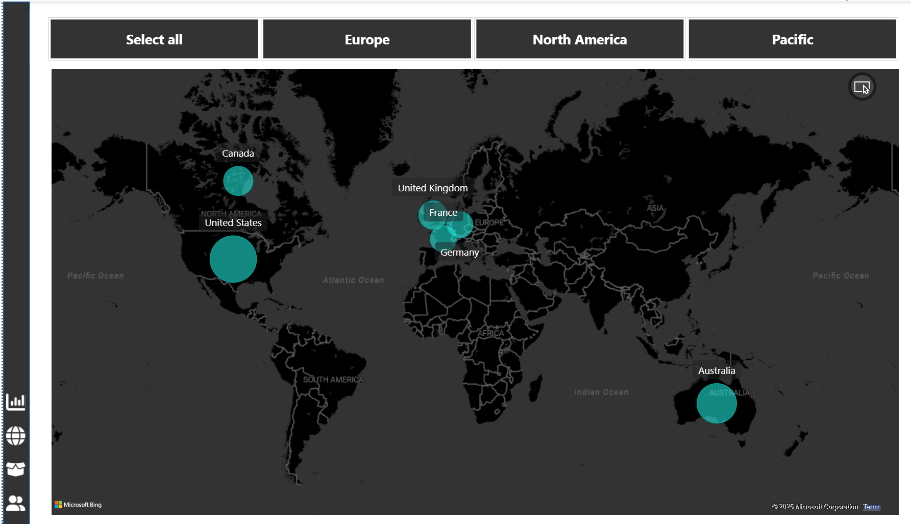

# AdventureWorks Sales Dashboard – Power BI Project

This is a guided Power BI project I completed as part of the "Microsoft Power BI Desktop for Business Intelligence" course on Udemy.

## 📁 File
- Adventure Works Report.pbix

## 🛠 Tools Used
- Power BI
- Power Query Editor
- DAX
- Data Modeling

## 📊 Dashboard Features
- Executive KPIs: Revenue, Profit, Orders, Return Rate
- Region-wise Sales Map
- Product & Customer Insights
- Dynamic Slicers for drill-down

## 📷 Screenshots

### 1️⃣ Executive Dashboard  

### 2️⃣ Region-wise Sales Map  

### 3️⃣ Product Performance Details  

### 4️⃣ Customer Insights  

